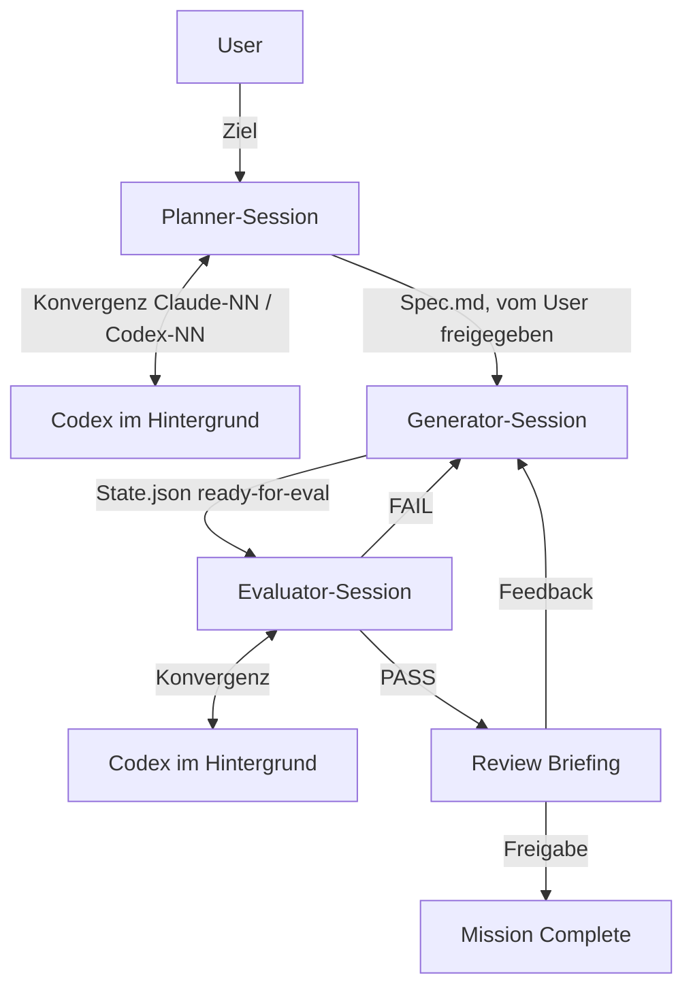

# Evaluierung: FlineDev/TandemKit

**Quelle:** <https://github.com/FlineDev/TandemKit>
**Stand:** Commit `72c4709` (Version 1.4.0) vom 2026-05-02, durchgesehen am 2026-09-06
**Umfang:** 3 Skills (`planner`, `generator`, `evaluator`), 1 Command (`init`), 4 Bash-Skripte, 6 Evaluierungs-Strategien,
1 Systemprompt, ca. 3400 Zeilen Markdown. 40 Stars, 2 Forks. Autor Cihat Gündüz, MIT.

## Einordnung

TandemKit setzt Anthropics Harness-Artikel („Claude stops too early") als Plugin um: drei getrennte Claude-Code-Sessions
mit je einer Rolle, dazu Codex als zweites Modell in Planung und Bewertung.

Koordination zwischen Generator und Evaluator läuft über `TandemKit/<Mission>/State.json`. Jede Übergabe ist ein
zweistufiges „Signal": Feld flippen **und** `wait-for-state.sh` als Background-Bash-Task starten, dessen Ende die
nächste Runde der anderen Session auslöst (watchman-wait, Fallback md5-Polling). Alles liegt als Klartext im
Missionsordner (`Planner-Discussion/`, `Generator/Round-NN.md`, `Evaluator/Round-NN-Discussion/`, `Assets/`).

Das Konvergenzprotokoll ist in Planner und Evaluator identisch: beide Modelle untersuchen unabhängig, Claude merged,
Codex reviewt mit Schweregraden (high/medium/low), Iteration bis keine high/medium-Widersprüche mehr bestehen; nach
drei Runden mit demselben Dissens entscheidet der User.

## Direkt einbindbar

| Baustein | Pfad | Warum |
|---|---|---|
| Spec-Format | `skills/planner/templates/Spec-Format.md` | Die klarste Datei im Repo. Spec ist WAS und WARUM, nie WIE: neun feste Sektionen (Mission Type, User Intent wörtlich, Goal, Findings als Referenzen statt Transkription, Acceptance Criteria, Edge Cases, Key Decisions mit Alternativen, Out of Scope, Possible Directions). Zwei Tests, die sich merken lassen: „Würde ich widersprechen, wenn der Generator es anders löst, aber alle Kriterien erfüllt?" (dann ist es HOW) und „Kämen zwei unabhängige Evaluatoren ohne Rücksprache zum selben Urteil?" (sonst ist das Kriterium mehrdeutig). Sprachagnostisch, passt auf Nix-, Bash- und Doku-Vorhaben. |
| Evaluator-Systemprompt | `system-prompts/claude-evaluator.md` | Zwanzig Zeilen, generisch: Generator-Berichte als unbelegte Behauptungen, ganze Dateien statt Diffs lesen, jede Runde alles neu verifizieren, bei null Findings zweiter Durchgang auf Auslassungen, BLOCKED statt PASS wenn die nötige Verifikation nicht möglich ist. Per `claude --append-system-prompt-file` sofort nutzbar, auch ohne den Rest des Plugins. |

## Anpassen, dann einbinden

| Baustein | Pfad | Nötiger Umbau |
|---|---|---|
| Review Briefing | `skills/generator/SKILL.md` §Review Briefing | Zwei Listen tragen die Übergabe: „What I confirmed works" (Verhalten + konkreter Beleg: welcher Test, welches Kommando, welche Datei) und „What I could NOT confirm" (mit dem konkreten Hindernis, nicht nur „unverified"). „You should test X" ist verboten, der User prüft stichprobenartig nach eigenem Ermessen. Deckt sich mit der eigenen Regel, Ergebnisse ehrlich zu berichten. Umbau: als Abschluss-Format in die eigenen Agenten-Definitionen (Nixie nach `switch`, Bertram/Christian nach Live-Eingriff) übernehmen; die `file://`-Links und die Stats-Zeile können entfallen. |
| Domain-Strategie | `skills/evaluator/strategies/Domain.md` | Canonical-Case-Tests mit Pflichtfragen, erwarteten Eigenschaften und Red Flags; Konsistenzprüfung (gleicher Input, gleiche Argumentation); Fabrikations-Erkennung (zitierte Regeln/Normen müssen existieren). Für BSI-Dokumente (Bruce), Grimm-Texte und Netz-Konzepte der passendste Teil. Umbau: Case-Dateien in den Vault, Quellenprüfung über `recherche/<slug>.md` statt freiem Web. |
| Mission-Complete-Gate | `skills/generator/SKILL.md` §Mission Complete | Nur explizite Nutzer-Freigabe schließt ab („passt", „fertig", „ship it"); ein PASS des Evaluators, grüne Kriterien oder ein Dank sind ausdrücklich **keine** Trigger. Entspricht der eigenen Regel „Diskussion ≠ Editier-Freigabe". Der fünfteilige Closeout (Summary schreiben, State, Config, Summary zeigen, Commit-Frage) ist plugin-spezifisch; das Gate selbst ist die übernehmbare Idee. |
| Commit-Regel | `skills/generator/SKILL.md` §Commit Messages | Commits und PR-Texte beschreiben die Änderung, nie den Prozess (keine Runden, Rollen, Iterationen). Die eigene Regel „keine Claude-Banner" deckt das schon ab; die Gut/Schlecht-Tabelle taugt als Ergänzung der Projekt-CLAUDE.md. |
| CLI-Strategie | `skills/evaluator/strategies/CLI.md` | Verifikation über Exit-Codes, `diff` gegen erwartete Ausgabe, `jq`-Checks. Trivial, aber als Checkliste für Bash-Skript-Evaluierung brauchbar. Umbau: Ausführung in `nix-shell`, Shellcheck ergänzen. |

## Nicht übernehmen

| Baustein | Grund |
|---|---|
| Plugin als Ganzes (`/plugin install tandemkit`) | Alle Skills und Skripte referenzieren hart `~/.claude/plugins/cache/FlineDev/tandemkit/latest`; eine Installation aus dem eigenen Marketplace bricht jeden Skript-Aufruf. Codex-Zugriff läuft über Symlinks nach `~/.agents/skills/`, nicht über ein Codex-Manifest. |
| Codex-Integration | Pflicht, kein Single-Model-Modus, fest verdrahtet auf `codex-plugin-cc` (`/codex:rescue --fresh\|--resume --effort --write`). Das eigene `ask`-Plugin löst dieselbe Aufgabe über `codex exec` mit Sandbox-Rechten. Beides parallel wäre doppelt. |
| Signal-Protokoll / Watcher (`wait-for-state.sh`, `unstick.sh`) | Eingestandenermaßen fragil: in jeder Rolle als „NON-NEGOTIABLE" mit ⛔ markiert, eigenes Diagnose-Skript für Deadlocks, und der Generator-Skill dokumentiert selbst, dass in vier realen Missionen `Summary.md` nie geschrieben und `currentMission` zweimal nicht geleert wurde. Der Mechanismus (Background-Task-Ende als Cross-Turn-Wecker) funktioniert, aber drei Sessions plus Hintergrund-Codex pro Runde sind teuer; das README rät selbst von kleinen Aufgaben ab. |
| `commands/init.md`, Strategien `ApplePlatform.md`, `Android.md`, `Web.md`, `Web-Playwright.md` | Durchgehend macOS/App-zentriert: `brew`, `xcodebuildmcp`, Peekaboo, `curl \| bash` für browser-use, `npx`. Die eigenen Codeobjekte sind Nix, Bash und Doku. |
| Stall-Erkennung (Planner/Evaluator §Codex Stall Detection) | `stat -f "%Sm"` und `/private/tmp/claude-501/...` sind macOS; auf Linux schlicht falsch. Auch `md5 -q`, `screencapture`, `sips`/`cwebp` via brew. |
| Stil der SKILL.md-Dateien | 400 bis 500 Zeilen pro Rolle, Großbuchstaben, „NEVER"/„NON-NEGOTIABLE", Wiederholungen derselben Regel in drei Abschnitten. Das Gegenteil dessen, was in [[evaluierung-mattpocock-skills]] unter `writing-for-agents` als gut befunden wurde (leading words, No-op-Test, Negations-Falle). |

**Kleinere Mängel:** Drei referenzierte Templates fehlen im Repo (`Generator-Round-Format.md`, `Summary-Format.md`,
`Evaluator-Round-Format.md`); die Formate stehen inline in den Skills, es bricht also nichts. Nur eine aktive Mission
pro Checkout (`Config.json`), Parallelität nur über Worktrees.

## Bezug zum eigenen Setup

- **`ask`-Plugin:** Deckt die Cross-CLI-Zweitmeinung bereits ab, host-agnostisch und mit Rechte-Matrix. TandemKits
  Mehrwert liegt nicht in der Codex-Anbindung, sondern in der Rollentrennung und den Formaten.
- **Dual-Pflege Claude/Codex:** TandemKit macht Skills für Codex über Symlinks nach `~/.agents/skills/` sichtbar und
  lässt Codex den Preflight selbst reparieren. Kein Codex-Plugin-Manifest, also kein Vorbild für die eigene
  Marketplace-Struktur.
- **Grilling / iteratives Vorgehen:** Der Planner-Ablauf (erst untersuchen, dann eine Frage nach der anderen per
  `AskUserQuestion`, Spec-Freigabe mit drei Optionen) passt zur eigenen Regel „Entscheidungen per Tool" und zu
  `grilling` aus der mattpocock-Evaluierung.

## Installationsweg

Kein Plugin-Install. Die vier verwertbaren Bausteine (Spec-Format, Evaluator-Systemprompt, Review Briefing,
Domain-Strategie) aus einem Klon übernehmen und an Vault, Nix und Umlaute anpassen.

Eine schlanke Eigenvariante wäre: zwei Sessions (Generator, Evaluator) ohne Watcher-Apparat, Übergabe per
Klartext-Dateien im Projekt, der Evaluator holt seine Zweitmeinung über `/ask`. Das bildet den Kern des Konzepts
(getrennter, skeptischer Evaluator mit Systemprompt) ohne die macOS- und `codex-plugin-cc`-Abhängigkeiten ab.

## Lizenz

MIT (siehe `LICENSE` im Quell-Repo). Übernahme mit Herkunftsvermerk unproblematisch, analog zu
`vendors/obsidian-skills`.

## Nächster Schritt

Vorschlag: mit `Spec-Format.md` und `claude-evaluator.md` anfangen, beide unverändert. Das Review-Briefing-Format
danach in die Abschlussberichte der eigenen Agenten einarbeiten.
