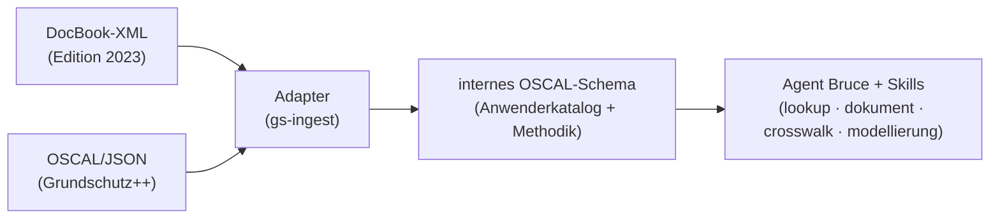

# it-grundschutz

IT-Grundschutz-Berater (Persona **Bruce**) für Claude Code. Hält das BSI-IT-Grundschutz-Kompendium als
**lokalen OSCAL-Korpus** vor und schlägt Anforderungen zitierfähig nach, modelliert Bausteine für
Szenarien, führt den IT-Grundschutz-Check (Soll-Ist-Umsetzungsprüfung) durch und begleitet Editionswechsel.

## Warum überhaupt ein lokaler Korpus?

Allgemeine Web-Recherche zerfasert das Kompendium (Blog-Zusammenfassungen, veraltete Editionen) und ist
nicht zitierfähig. Der Korpus ist dagegen stabil, stark strukturiert (Schichten → Anforderungen mit IDs)
und stark verlinkt — der Idealfall für lokales Vorhalten: offline, reproduzierbar, mit wortgetreuem Zitat.

## Architektur: Quelle und Logik getrennt

Der eigentliche Hebel ist die Trennung von **Korpus** (austauschbare Daten) und **Logik** (stabiler Agent +
Skills). Editionen wechseln das Format — Edition 2023 ist DocBook-XML, Grundschutz++ (seit 2026) ist
OSCAL/JSON, agil über GitHub gepflegt. Der Agent darf das nie direkt sehen.



Kanonisches internes Format ist **OSCAL** (NIST-Standard). Grundschutz++ ist schon OSCAL (nur laden),
Edition 2023 wird über den DocBook→OSCAL-Adapter `scripts/adapter-2023.py` normalisiert. Eine neue
Edition = ein neuer Adapter, sonst nichts.

## Quelle & Lizenz

| | |
|---|---|
| Repo | [`BSI-Bund/Stand-der-Technik-Bibliothek`](https://github.com/BSI-Bund/Stand-der-Technik-Bibliothek) |
| Datei | `Anwenderkataloge/Grundschutz++/Grundschutz++-catalog.json` (OSCAL 1.1.x) |
| Korpus-Lizenz | **CC BY-SA 4.0** (Attribution + ShareAlike) |
| Plugin-Code-Lizenz | MIT |

Wegen des Lizenz-Unterschieds wird der Korpus **nicht** ins Plugin-Git eingecheckt, sondern lokal vorgehalten:
`$GS_CORPUS_DIR` (default `~/.local/share/it-grundschutz/corpus`).

## Nutzung

```bash
# Korpus laden/aktualisieren
nix run .#ingest                  # Grundschutz++ (OSCAL von GitHub)
nix run .#ingest-2023             # Edition 2023 (DocBook-XML -> OSCAL)

# Nachschlagen
nix run .#gs -- status            # Korpus-Status
nix run .#gs -- groups            # Schichten/Gruppen
nix run .#gs -- list GC KONF.2    # Anforderungen einer/mehrerer Schichten/Gruppen oder exakter IDs
nix run .#gs -- targets           # Zielobjektkategorien (nur Grundschutz++) — Basis für gs-modellierung
nix run .#gs -- list --target Hostsysteme --inherit   # zielobjektbasiert: Anforderungen für "Server" (+ Vererbung)
nix run .#gs -- get GC.1.1        # eine Anforderung volltext + Methodik-Ebene (das Warum)
nix run .#gs -- search "ISMS"     # Volltextsuche
nix run .#gs -- prozess           # Vorgehensweise (Methodik-Ebene) — Basis für gs-dokument
nix run .#gs -- checklist UMS KONF.2  # leere Soll-Ist-Check-Vorlage (mehrere Gruppen/IDs) — Basis für gs-review

# Edition 2023 abfragen (--edition vor dem Kommando)
nix run .#gs -- --edition edition-2023 get SYS.1.1.A5
nix run .#gs -- --edition edition-2023 checklist SYS.1.1   # Check-Vorlage inkl. entfallen-Markierung
```

In Claude Code: `/bruce <auftrag>` ruft den Agenten auf. Build-Details in [`build.md`](./build.md).

## Grenzen / Scope

- **Rein generisch.** Nur das öffentliche BSI-Korpus + generische Modellierung. Firmenspezifische
  Informationsverbünde, Umsetzungsstände und vertrauliche Daten gehören **nicht** hierher, sondern in ein
  getrenntes, vertrauliches Repo/Vault.
- **Beide Editionen verfügbar.** Grundschutz++ (OSCAL) und Edition 2023 (DocBook-XML → OSCAL via
  `scripts/adapter-2023.py`), getrennt abfragbar über `--edition`. Der formale Baustein↔Gefährdung-Kreuzbezug
  der Edition 2023 ist nicht Teil des Kompendium-XML und daher bewusst ausgelassen (siehe `gs-ingest`).
- Bruce liefert die normative Grundlage — die Bewertung/Entscheidung trifft der Mensch.
