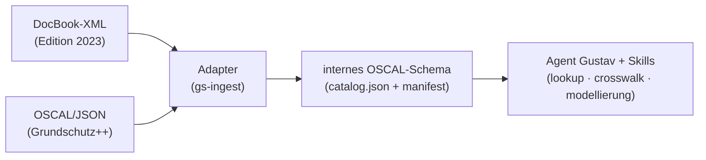

# it-grundschutz

IT-Grundschutz-Berater (Persona **Gustav**) fuer Claude Code. Haelt das BSI-IT-Grundschutz-Kompendium als
**lokalen OSCAL-Korpus** vor und schlaegt Anforderungen zitierfaehig nach, modelliert Bausteine fuer
Szenarien und begleitet Editionswechsel.

## Warum ueberhaupt ein lokaler Korpus?

Allgemeine Web-Recherche zerfasert das Kompendium (Blog-Zusammenfassungen, veraltete Editionen) und ist
nicht zitierfaehig. Der Korpus ist dagegen stabil, stark strukturiert (Schichten → Anforderungen mit IDs)
und stark verlinkt — der Idealfall fuer lokales Vorhalten: offline, reproduzierbar, mit wortgetreuem Zitat.

## Architektur: Quelle und Logik getrennt

Der eigentliche Hebel ist die Trennung von **Korpus** (austauschbare Daten) und **Logik** (stabiler Agent +
Skills). Editionen wechseln das Format — Edition 2023 ist DocBook-XML, Grundschutz++ (seit 2026) ist
OSCAL/JSON, agil ueber GitHub gepflegt. Der Agent darf das nie direkt sehen.



Kanonisches internes Format ist **OSCAL** (NIST-Standard). Grundschutz++ ist schon OSCAL (nur laden),
Edition 2023 bekaeme spaeter einen DocBook→OSCAL-Adapter. Eine neue Edition = ein neuer Adapter, sonst nichts.

## Quelle & Lizenz

| | |
|---|---|
| Repo | [`BSI-Bund/Stand-der-Technik-Bibliothek`](https://github.com/BSI-Bund/Stand-der-Technik-Bibliothek) |
| Datei | `Anwenderkataloge/Grundschutz++/Grundschutz++-catalog.json` (OSCAL 1.1.x) |
| Korpus-Lizenz | **CC BY-SA 4.0** (Attribution + ShareAlike) |
| Plugin-Code-Lizenz | MIT |

Wegen des Lizenz-Unterschieds wird der Korpus **nicht** ins Plugin-Git eingecheckt, sondern lokal vorgehalten:
`$GS_CORPUS_DIR` (default `~/.local/share/it-grundschutz/corpus`).

## Nutzung

```bash
# Korpus laden/aktualisieren
nix run .#ingest

# Nachschlagen
nix run .#gs -- status            # Korpus-Status
nix run .#gs -- groups            # Schichten/Gruppen
nix run .#gs -- list GC           # Anforderungen einer Schicht
nix run .#gs -- get GC.1.1        # eine Anforderung volltext, zitierfaehig
nix run .#gs -- search "ISMS"     # Volltextsuche
```

In Claude Code: `/gustav <auftrag>` ruft den Agenten auf. Build-Details in [`build.md`](./build.md).

## Grenzen / Scope

- **Rein generisch.** Nur das oeffentliche BSI-Korpus + generische Modellierung. Firmenspezifische
  Informationsverbuende, Umsetzungsstaende und vertrauliche Daten gehoeren **nicht** hierher, sondern in ein
  getrenntes, vertrauliches Repo/Vault.
- **Aktuell nur Grundschutz++.** Edition-2023-Adapter und vollwertiger Crosswalk sind vorbereitet, aber noch
  nicht implementiert (siehe Skills `gs-crosswalk`, `gs-ingest`).
- Gustav liefert die normative Grundlage — die Bewertung/Entscheidung trifft der Mensch.
