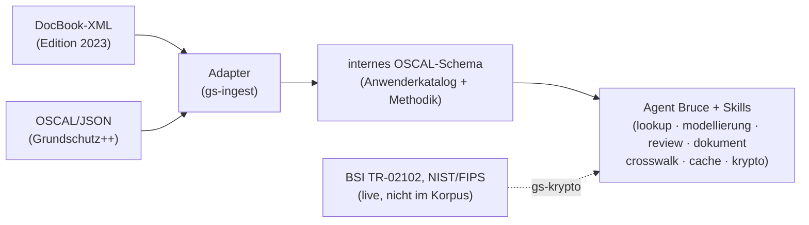

# it-grundschutz

IT-Grundschutz-Berater (Persona **Bruce**) für Claude Code und Codex. Hält das BSI-IT-Grundschutz-Kompendium
als **lokalen OSCAL-Korpus** vor und schlägt Anforderungen zitierfähig nach, modelliert Bausteine für
Szenarien, führt den IT-Grundschutz-Check (Soll-Ist-Umsetzungsprüfung) durch und begleitet Editionswechsel.

## Warum überhaupt ein lokaler Korpus?

Allgemeine Web-Recherche zerfasert das Kompendium (Blog-Zusammenfassungen, veraltete Editionen) und ist
nicht zitierfähig. Der Korpus ist dagegen stabil, stark strukturiert (Schichten → Anforderungen mit IDs)
und stark verlinkt — der Idealfall für lokales Vorhalten: offline, reproduzierbar, mit wortgetreuem Zitat.

## Architektur: Quelle und Logik getrennt

Der eigentliche Hebel ist die Trennung von **Korpus** (austauschbare Daten) und **Logik** (stabiler Agent +
Skills). Editionen wechseln das Format — Edition 2023 ist DocBook-XML, Grundschutz++ (seit 2026) ist
OSCAL/JSON, agil über GitHub gepflegt. Der Agent darf das nie direkt sehen.


```mermaid
flowchart LR
    A["DocBook-XML<br/>(Edition 2023)"] --> ADAPTER
    B["OSCAL/JSON<br/>(Grundschutz++)"] --> ADAPTER
    ADAPTER["Adapter<br/>(gs-ingest)"] --> SCHEMA["internes OSCAL-Schema<br/>(Anwenderkatalog + Methodik)"]
    SCHEMA --> LOGIK["Agent Bruce + Skills<br/>(lookup · modellierung · review · dokument<br/>crosswalk · cache · krypto)"]
    TR["BSI TR-02102, NIST/FIPS<br/>(live, nicht im Korpus)"] -.->|gs-krypto| LOGIK
```

Kanonisches internes Format ist **OSCAL** (NIST-Standard). Grundschutz++ ist schon OSCAL (nur laden),
Edition 2023 wird über den DocBook→OSCAL-Adapter `scripts/adapter-2023.py` normalisiert. Eine neue
Edition = ein neuer Adapter, sonst nichts.

## Quelle & Lizenz

| | |
|---|---|
| Repo | [`BSI-Bund/Stand-der-Technik-Bibliothek`](https://github.com/BSI-Bund/Stand-der-Technik-Bibliothek) |
| Datei | `Anwenderkataloge/Grundschutz++/Grundschutz++-catalog.json` (OSCAL 1.1.x) |
| Korpus-Lizenz | **CC BY-SA 4.0** (Attribution + ShareAlike) |
| Plugin-Code-Lizenz | MIT |

Wegen des Lizenz-Unterschieds wird der Korpus **nicht** ins Plugin-Git eingecheckt, sondern lokal vorgehalten:
`$GS_CORPUS_DIR` (default `~/.local/share/it-grundschutz/corpus`).

## Komponenten

| Typ | Name | Zweck |
|-----|------|-------|
| Agent | `it-grundschutz:bruce` | IT-Grundschutz-Persona, liest die Skills bei Bedarf |
| Command | `/bruce` | Bruce direkt aufrufen (mit optionalem Auftrag) |
| Skill | `gs-ingest` | Korpus laden und aktuell halten (Grundschutz++, Edition 2023) |
| Skill | `gs-lookup` | Anforderungen und Bausteine zitierfähig nachschlagen |
| Skill | `gs-modellierung` | Zutreffende Bausteine und Anforderungen für ein Szenario ermitteln |
| Skill | `gs-review` | IT-Grundschutz-Check (Soll-Ist-Umsetzungsprüfung) |
| Skill | `gs-dokument` | Sicherheitsdokumente nach der Methodik erstellen, führen oder prüfen |
| Skill | `gs-crosswalk` | Editionswechsel und Mapping, editionsübergreifend heuristisch |
| Skill | `gs-cache` | Projekt-lokaler Baustein-Vorrat im Volltext |
| Skill | `gs-krypto` | Krypto-Bewertung nach BSI TR-02102 mit NIST/FIPS-Gegenprobe |

Die Skills sind Bruces Fachwissen und für den automatischen Aufruf gesperrt: Sie stehen weder im
Kontext der Hauptsitzung noch in dem anderer Agenten. Bruce liest die jeweilige `SKILL.md` erst, wenn
ein Auftrag sie braucht. Von Hand holst du einen Skill mit `/it-grundschutz:gs-lookup` (Claude Code) bzw.
`$it-grundschutz:gs-lookup` (Codex) in die laufende Sitzung. So geladen wirkt er allein: Seine Verweise
auf andere Skills werden nicht nachgeladen.

## Nutzung

Die Befehle gelten im Plugin-Verzeichnis. Von anderswo das Flake per `path:` adressieren, etwa
`nix run "path:/pfad/zum/plugin#gs" -- status`; so rufen Agent und Skills auf.

```bash
# Korpus laden/aktualisieren
nix run .#ingest                  # Grundschutz++ (OSCAL von GitHub)
nix run .#ingest-2023             # Edition 2023 (DocBook-XML -> OSCAL)

# Nachschlagen
nix run .#gs -- status            # Korpus-Status
nix run .#gs -- groups            # Schichten/Gruppen
nix run .#gs -- list GC KONF.2    # Anforderungen einer/mehrerer Schichten/Gruppen oder exakter IDs
nix run .#gs -- targets           # Zielobjektkategorien (nur Grundschutz++) — Basis für gs-modellierung
nix run .#gs -- list --target Hostsysteme --inherit   # zielobjektbasiert: Anforderungen für "Server" (+ Vererbung)
nix run .#gs -- coverage --targets "Hostsysteme,Netze,Administrierende"  # Soll über mehrere Assets + STM.5.4-Lücke
nix run .#gs -- get GC.1.1        # eine Anforderung volltext + Methodik-Ebene (das Warum)
nix run .#gs -- search "ISMS"     # Suche (nach Token-Überlappung/Score sortiert)
nix run .#gs -- prozess           # Vorgehensweise (Methodik-Ebene) — Basis für gs-dokument
nix run .#gs -- checklist UMS KONF.2  # leere Soll-Ist-Check-Vorlage (mehrere Gruppen/IDs) — Basis für gs-review
nix run .#gs -- crosswalk SYS.1.1.A5  # heuristischer Crosswalk: 2023-ID → Top-Kandidaten in ++ — Basis für gs-crosswalk

# Baustein-Vorrat (projekt-lokal materialisieren) — Basis für gs-cache
nix run .#gs -- --edition edition-2023 cache --out projekt/Vorrat.md --title "IAM" --targets "Server,Netz,Verzeichnisdienst" APP.2.3  # Satz aus Szenario ableiten (+ Hand-Pin)
nix run .#gs -- --edition edition-2023 cache --out projekt/Vorrat.md --targets "Server,Netz,Verzeichnisdienst,Datenbank"            # Rebuild: neue Bausteine rein, weggefallene gepruned (Δ-Ausgabe)
nix run .#gs -- --edition edition-2023 cache --out projekt/Vorrat.md --status   # Frische + targets + Hand-Pins

# Edition 2023 abfragen (--edition vor dem Kommando)
nix run .#gs -- --edition edition-2023 get SYS.1.1.A5
nix run .#gs -- --edition edition-2023 checklist SYS.1.1   # Check-Vorlage inkl. entfallen-Markierung
nix run .#gs -- --edition edition-2023 coverage --targets "Server,Webanwendung,Netz"  # Bausteinabdeckung (heuristische Hinttabelle)
```

`/bruce <auftrag>` ruft Bruce auf; ohne Text meldet er den Korpus-Status und fragt nach dem Auftrag. Unter
Codex, das keine Plugin-Agenten kennt, lädt der Command die Rollenanweisung aus `agents/bruce.md`.
Build-Details in [`build.md`](./build.md).

## Grenzen / Scope

- **Rein generisch.** Nur das öffentliche BSI-Korpus + generische Modellierung. Firmenspezifische
  Informationsverbünde, Umsetzungsstände und vertrauliche Daten gehören **nicht** hierher, sondern in ein
  getrenntes, vertrauliches Repo/Vault.
- **Beide Editionen verfügbar.** Grundschutz++ (OSCAL) und Edition 2023 (DocBook-XML → OSCAL via
  `scripts/adapter-2023.py`), getrennt abfragbar über `--edition`. Der formale Baustein↔Gefährdung-Kreuzbezug
  der Edition 2023 ist nicht Teil des Kompendium-XML und daher bewusst ausgelassen (siehe `gs-ingest`).
- **Heuristische Hilfen, klar gekennzeichnet.** Der editionsübergreifende Crosswalk (`gs crosswalk`) und die
  Edition-2023-Bausteinabdeckung (`gs coverage`, gespeist aus der plugin-eigenen Hinttabelle
  `data/edition-2023-baustein-komponenten.csv`, MIT) sind **begründete Heuristiken ohne offizielles
  BSI-Mapping** — die finale Entscheidung trifft der Mensch.
- Bruce liefert die normative Grundlage — die Bewertung/Entscheidung trifft der Mensch.
